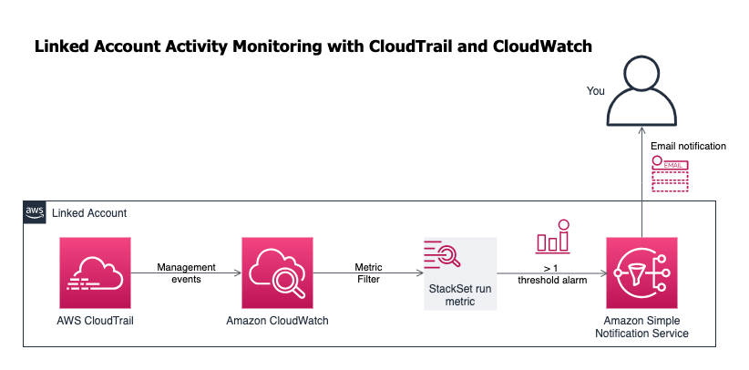

# Account activity monitoring with CloudTrail and CloudWatch

This CloudFormation is a complete example implementing AWS CloudTrail, Amazon CloudWatch and Amazon Simple Notification service
to monitor and alert on management events in an AWS account. Here we provide an example metric filter that creates a metric with
value 1 if a stackset is created via the management account. A CloudWatch alarm then alerts when the metric is greater than or 
equal to 1.



Even though I only specify a single alarm action here, on testing AWS send two - one on Alarm and one on OK. You have to interpret
this as the first one is an important alarm. The second just says no more stacksets were applied in the last five minutes.

## How to use this template

If you do not have existing monitoring SNS topics nor CloudTrail enabled on your account, you can deploy the template as is.
It will create the various components and all you will need to do is subscribe to the SNS topic with your (personal/security/operations/monitoring team) emails.

If you have existing CloudTrail setup as per this template and/or existing SNS topics for monitoring you can customise the
template to reference your existing trail, etc.

## Adding more metrics

This template ships with a single "CreateStack" where the user is "stackset-exec*" metric filter and an alarm on it. You could
add additional metrics and alarms by repeating the metric filter and alarm blocks with appropriate filters (```FilterPattern```):

```yaml
  CreateStackMetricFilter:
    Type: AWS::Logs::MetricFilter
    Properties:
      FilterPattern: '{ ($.eventName = "CreateStack") && ($.userIdentity.sessionContext.sessionIssuer.userName = "stacksets-exec-*") }'
      LogGroupName: !Ref MonitoringCloudWatchLogGroup
      MetricTransformations:
        - MetricName: "stackset-executions"
          MetricNamespace: !Ref CloudWatchMetricNamespace
          MetricValue: "1" 
          DefaultValue: 0

  CreateStackAlarm:
    Type: AWS::CloudWatch::Alarm
    Properties:
      AlarmDescription: "Alert when monitoring:stackset-executions metric is greater than 0 in last 5 minutes"
      AlarmName: !Sub "${AWS::StackName}-org-stacksets-execution-alarm"
      ComparisonOperator: GreaterThanOrEqualToThreshold
      EvaluationPeriods: 1
      Period: 60
      Namespace: !Ref CloudWatchMetricNamespace
      MetricName: "stackset-executions"
      TreatMissingData: notBreaching
      Statistic: "Average"
      Threshold: 1
      AlarmActions:
        - !Ref MonitoringSNSTopic
```

## A word about cost
Using this template will add some charges to your account, especially if you already have an existing CloudTrail,
even an org-wide one created by the AWS Organisation your account is part of (as is the case with Jisc OCRE). There
are also costs associated with CloudWatch and sending alerts.

This template was created mainly for low-traffic accounts - such as offsite backup storage only accounts - where access
and account activity is infrequent. For these accounts the cost of an additional CloudTrail, etc. created here should
be very small. (As an example, my test account for this is forecasting $0.18 monthly spend - it only has a linked account with
this template applied). If you have any concerns we recommend that you use AWS Budgets and monitor costs on your account and also
familiarise yourself with AWS pricing for the resources deployed here.

* https://aws.amazon.com/cloudtrail/pricing/
* https://aws.amazon.com/cloudwatch/pricing/
* https://aws.amazon.com/aws-cost-management/aws-budgets/

## Need help?
Please get in touch and we'll be happy to help where we can.

https://www.jisc.ac.uk/cloud

